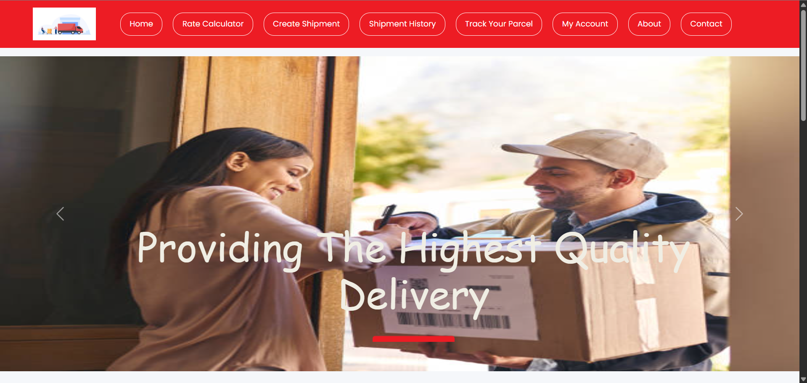

# 🚢 Cargo Booking Website

A full-stack cargo booking web application designed to simplify shipment booking, tracking, and payment processing.  
Built as an academic project to demonstrate web development, backend integration, and database management skills.

---

## 📌 Project Overview

The Cargo Booking Website allows users to:

- Create an account and log in securely
- Explore shipping services
- Book cargo shipments online
- Make payments using multiple payment methods
- Receive order confirmation
- Contact support for assistance

**Homepage Slogan:**  
> Seamless Shipping, Simplified Solutions.

---

## 🛠️ Tech Stack

### 💻 Frontend
- C#
- ASP.NET
- HTML
- CSS

### ⚙️ Backend
- Python

### 🗄️ Database
- MySQL

### 🖥️ Development Environment
- Microsoft Visual Studio 2022
- Windows OS

---

## 📂 Website Pages

- Homepage
- About Us
- Signup
- Login
- Services
- Booking
- Payment
- Order Confirmation
- Support
- Testimonials

---

## 💳 Payment Methods Supported

- UPI (GPay, Paytm)
- Debit Card
- Credit Card
- Cash on Delivery

---

## 🚀 Key Features

- User authentication system
- Secure booking form with validation
- Dynamic database integration
- Order confirmation system
- Clean and user-friendly UI
- Multi-payment support simulation
- Ship cargo themed design

---

## 🗃️ Database Design

The system uses MySQL to manage:

- User information
- Booking details
- Payment records
- Service data

---

## 🎯 Learning Outcomes

This project helped me strengthen my understanding of:

- Full-stack web development
- Backend integration with ASP.NET and Python
- Database connectivity using MySQL
- User authentication systems
- Payment workflow logic
- Structured web application design

---

## 📸 Screenshots

_Add screenshots of your homepage, booking page, and payment page here._

```bash
Example:

